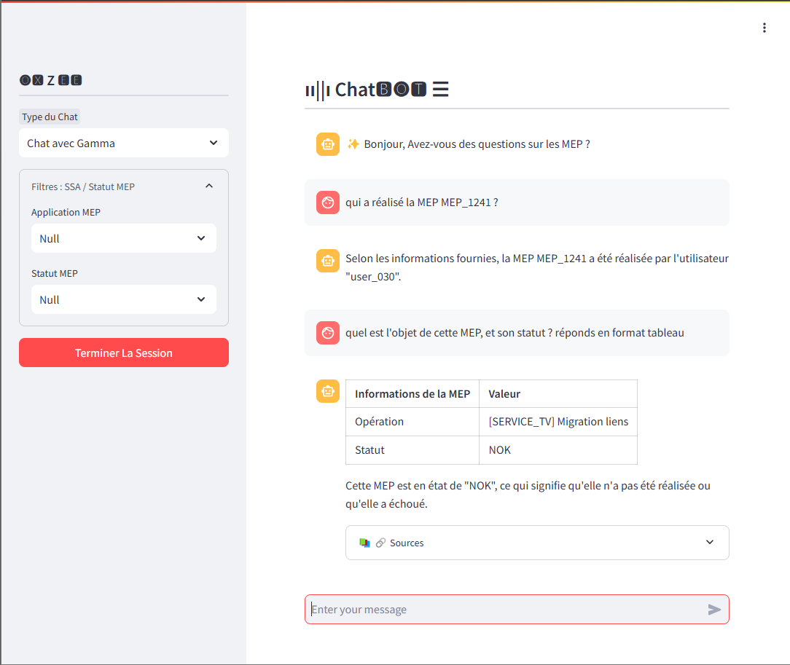
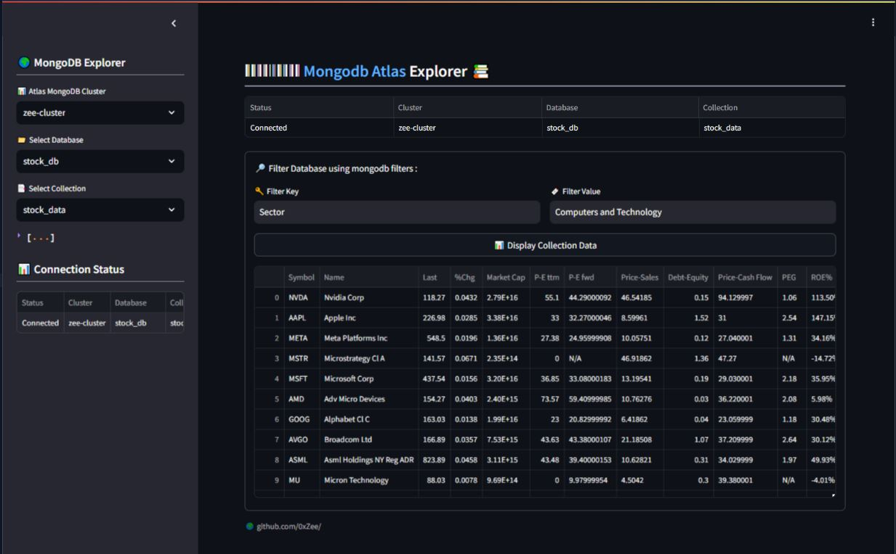

# 🤖 ChatBot
Streamlit ChatBot app to RAG into MongoDB Atlas :
- Inference & LLM : `Groq Inference`, Model : `llama3.2 3b`
- Embeddings : `Cohere`
- Vector Store : `MongoDB Atlas Vector Store`

```python
pip install -r requirements.txt
streamlit run app.py
```



# ⌨ APP DOCKERFILE : 
To build the App from Dockerfile
```python
pip install -r requirements.txt
streamlit run mongo_dashboard.py
```

# 📊 mongodb Dashboard
Streamlit ChatBot app to RAG into MongoDB Atlas

```bash
docker build -t mongodb-rag-app .
docker run -p 8501:8501 \
    -e GROQ_API_KEY=your_groq_api_key \
    -e COHERE_DEV_API=your_cohere_api_key \
    -e MONGO_URI=your_mongodb_connection_string \
    mongodb-rag-app
```


